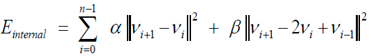
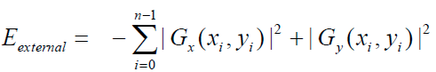
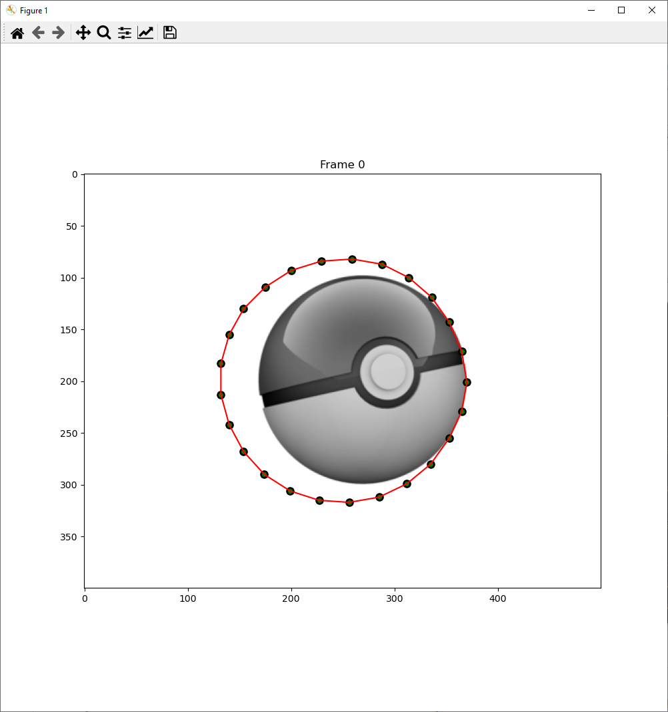
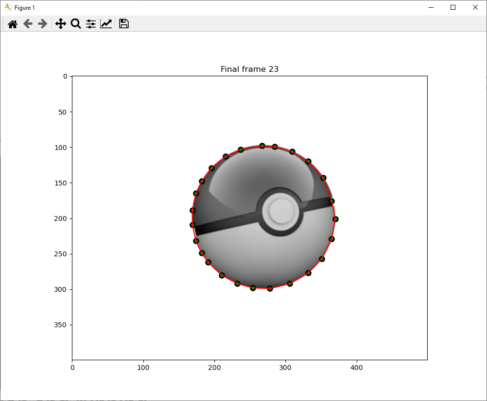
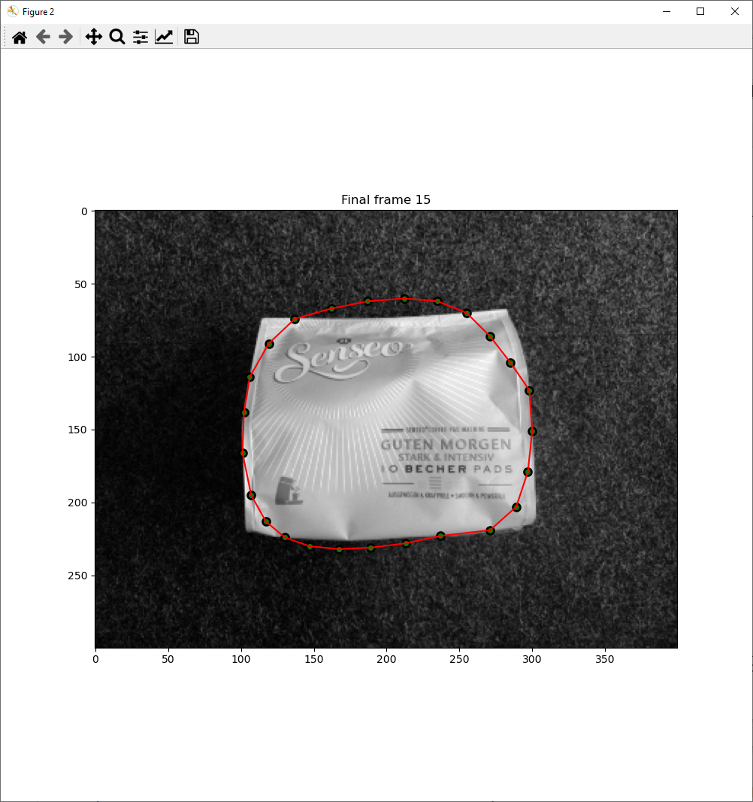

# Snakes: Active Contour Models

My implementation of an active contour model for a task in Computer Vision course at the University of Bonn.

## Task
Read the images ball.png and coffee.png and segment the object in both images using snakes. Initialize the snake by a circle around the object and optimize it using dynamic programming. The elastic term should be used as pairwise cost, penalizing deviation from the average distance between pairs of nodes. Visualize for both images how the snake converges to the boundary of the object.

## Solution notes
`initial.py` is the source code provided with the task description.

`solution.py` contains my code implementation.

I encapsulated methods into two classes: `Vertex` and `ActiveContour`. `ActiveContour` uses instances of `Vertex` with id, coordinates, cost and previous state, and `ActiveContour` contains methods for calculating total energy of the contour and checking for convergence.

This OOP approach to code organization allows for easily readable and customizable code.

## Theory
A snake is a deformable contour initialized near desired object and guided by energy cost evolves to fit the exact object's boundaries.

Total energy of the contour is defined as the sum of internal and external energies:

$$E_{total} = E_{internal} + E_{external}$$
where:

 - helps to achieve a more rigid snake by encouraging smoothness, elasticity.

 - encourages the contour to converge to image structures, e.g., edges.

Regularizing terms: $\alpha$ controls elasticity and $\beta$ - the curvature.

The goal of the algorithm is to minimize the total cost of the contour.

## Results

    

        
        
    

    

        
        
    

