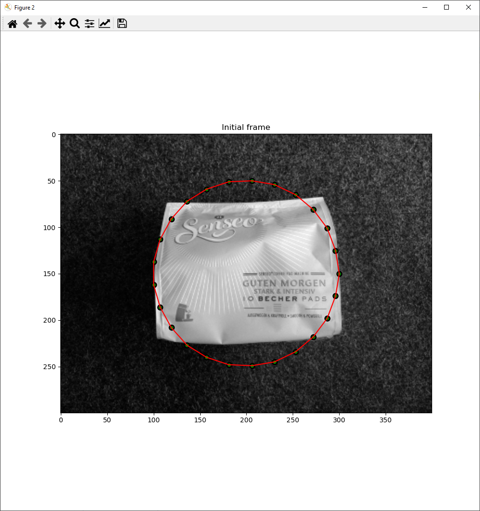

# Snakes: Active Contour Models

My implementation of an active contour model for a task in Computer Vision course at the University of Bonn.

## Task
Read the images ball.png and coffee.png and segment the object in both images using snakes. Initialize the snake by a circle around the object and optimize it using dynamic programming. The elastic term should be used as pairwise cost, penalizing deviation from the average distance between pairs of nodes. Visualize for both images how the snake converges to the boundary of the object.

## Results

    

        
        
    

    

        
        
    

